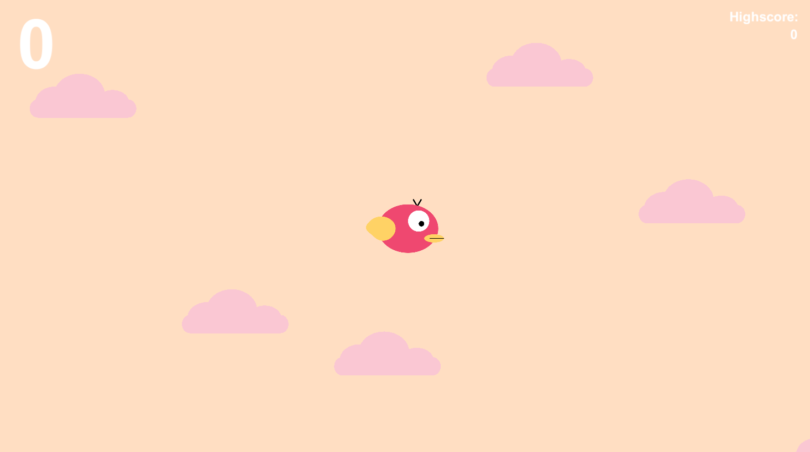

     
    <h1>Vogel</h1>
    

        <b>A bird flying through pipes</b>
    

     
    
     

## Description
Vogel ("Bird" in german) is a game about a bird flying as long as possible. On the way the bird has to dodge many pipes by flying through in between them.
This repository contains all the code as well as assets for this simple 2D game.

## Notes
This game was made after not using the Unity Engine for many years. The only purpose is to get to know the game engine again.
The assets where created in Affinity Designer by me for the purpose of demonstrating this game.

## Author
Marcus Gugacs

## License
See LICENSE file.
